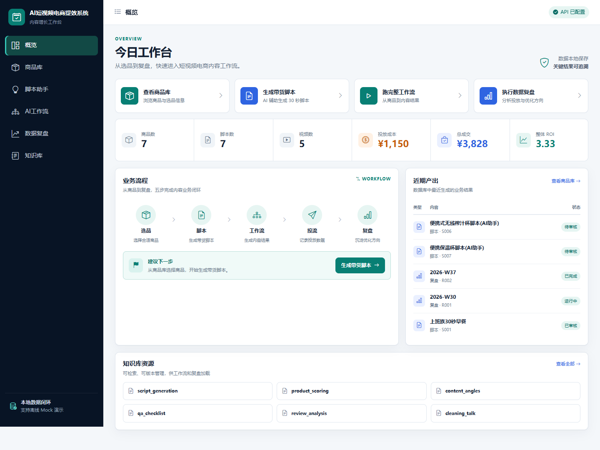
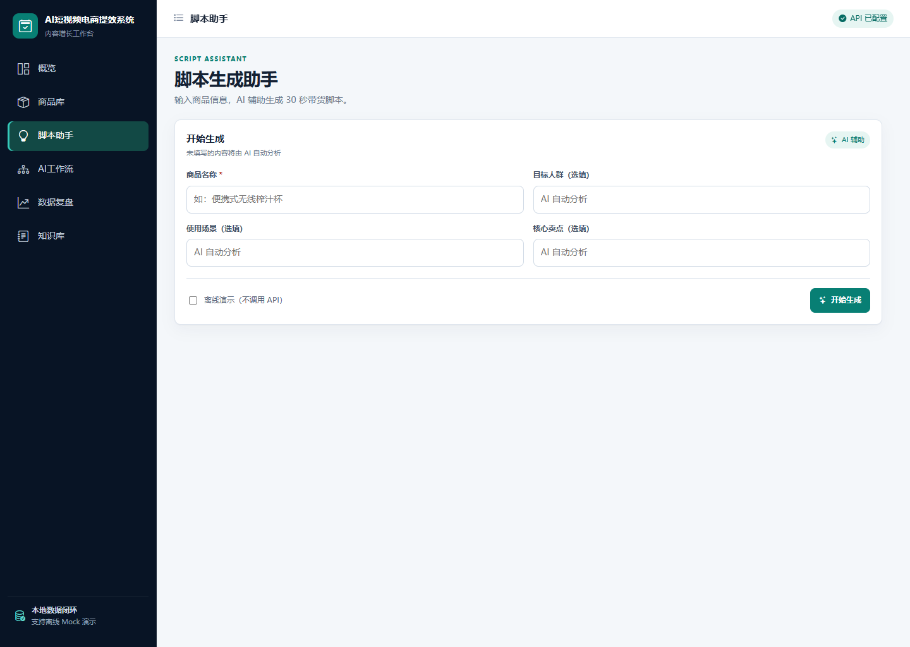
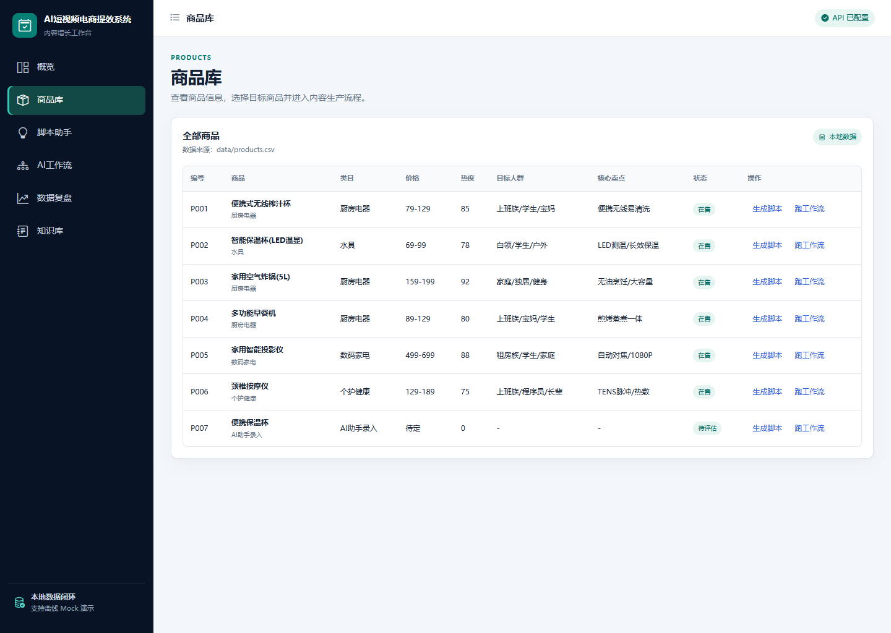
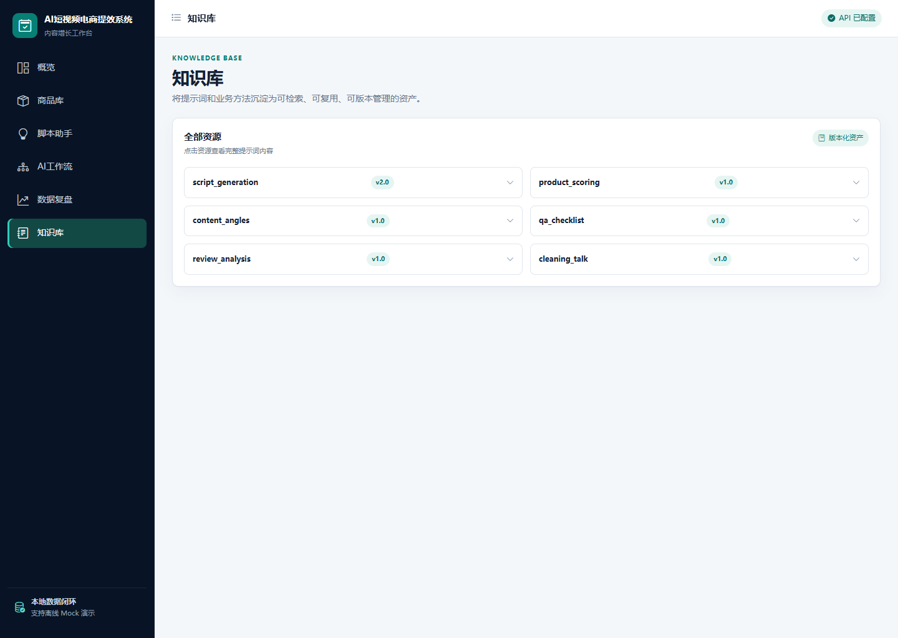
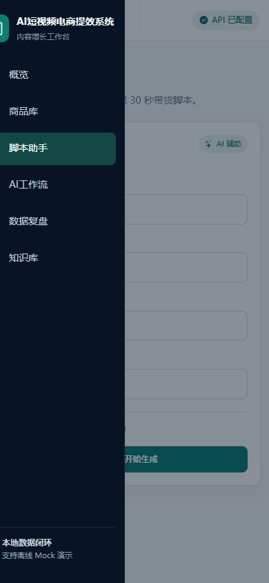
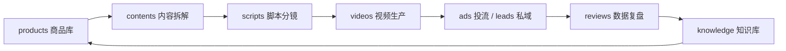
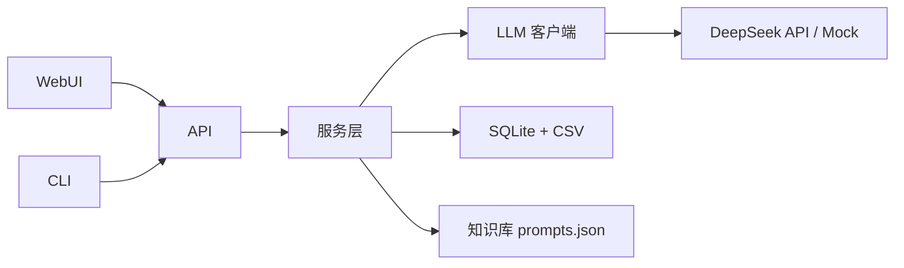

# AI短视频电商提效系统 — 从商品到脚本再到复盘的开源 AI 工作流

输入一个商品，AI 自动完成 **卖点分析 → 内容角度 → 30 秒脚本分镜 → 质检清单**，
生成结果真实回写数据库；发布后读取投流数据，AI 复盘结论再沉淀回知识库，
反哺下一轮内容生产。一个系统跑完「选品 - 内容 - 脚本 - 投流 - 复盘」全链路。

**WebUI / API / CLI 三种入口，一条命令启动，零第三方依赖；支持离线 Mock 演示，
没有 API Key 也能完整跑通，面试演示零成本。**


## 🖥️ 新版工作台

<p align="center">
  
</p>

> 左侧统一业务导航，首屏聚合快捷操作、核心指标、内容生产流程、近期产出和知识库资源。

## ✨ 亮点一览：30 秒看完为什么用它

独特能力 | 一句话
---|---|
🎯 数据闭环 | 工作流、脚本助手、复盘结果全部真实回写 SQLite，不是演示玩具
🖥️ 三端一体 | 同一个服务同时提供 WebUI、JSON API、CLI，前端/后端/脚本共用一套业务层
🆓 离线可演示 | `MOCK_AI=true` 免 API Key 完整跑通，面试或断网演示不花一分钱
📚 知识库沉淀 | 提示词可检索、可版本管理，工作流/智能体/复盘统一加载
🛡️ 结构化校验 | AI 输出缺失关键部分自动重试，不把坏脚本放进数据表
⚙️ 后台任务队列 | 耗时 AI 调用异步执行，前端轮询任务状态并实时查看日志
🧾 统一日志 | 控制台 + 文件双输出，出问题一眼定位
🔗 外键关联 | 8 张业务表通过 products → contents → scripts → videos → ads/leads → reviews 真实关联

## 🚀 30 秒跑起来

```bash
pip install -r requirements.txt
cp .env.example .env        # 没有 Key 就把 MOCK_AI=true
python scripts/init_db.py
python webui.py
```

浏览器自动打开 `http://127.0.0.1:8000`。页面里每个模块都可以单独勾选
「离线演示」，不需要重启服务。

## 📱 核心页面与移动端

| 脚本助手 | 商品库 |
| --- | --- |
|  |  |

| 知识库 | 移动端导航 |
| --- | --- |
|  | <p align="center"></p> |

## 🎬 三种玩法

- 🖥️ **Web 控制台**：浏览器里完成脚本生成、AI 工作流、数据复盘，适合演示和面试
- ⌨️ **CLI 命令行**：`python ai_workflow.py` / `python script_agent.py` / `python data_analysis.py`
- 🔌 **JSON API**：`/api/agent/generate`、`/api/workflow/run`、`/api/analysis/run`，可被其他系统集成

## 核心功能

### 一、AI 工作流（四步生成 + 人工审核节点）

1. **卖点分析**：AI 输出三大核心卖点、三类目标人群、三条内容禁忌
2. **内容角度**：生成 3 个差异化短视频角度（钩子 / 结构 / 转化方式）
3. **脚本分镜**：30 秒脚本，输出分镜表 / AI 画面提示词 / 剪辑要点 / 发布标题
4. **质检发布**：发布前检查表 + 3 个标题 + 3 条文生视频提示词

每步结果落盘，最后把内容拆解与脚本**真实回写** `contents.csv` + `scripts.csv` + SQLite。

### 二、脚本生成助手（智能体）

输入商品名称，AI 自动分析人群 / 场景 / 卖点 / 痛点，再生成完整 30 秒脚本；
输出缺失关键部分会自动重试；新商品会**自动入库**再关联脚本，外键闭环不会被截断。

### 三、数据复盘

读取真实投流数据，计算 ROI / CTR / 成交转化率 / 跳出率，区分付费投放与自然流量：

- 零投流视频不参与 ROI 排名，单独作为免费测款参考
- 最差样本只从付费视频中取，避免「自然流量数据差」误判
- AI 生成复盘报告，并把结论**回写** `reviews.csv` + `ecommerce.db`

### 四、知识库

提示词不是静态文件，而是一个可检索、可版本管理的资产库：

- 按关键词搜索提示词
- 新增 / 更新自动升级版本号
- 工作流、智能体、复盘统一从 `knowledge/prompts.json` 加载

### 五、数据闭环



## 技术栈

| 层 | 技术 |
| --- | --- |
| 后端 | Python 3.12 + 标准库 HTTP 服务 |
| 大模型 | DeepSeek API（OpenAI 兼容，可替换） |
| 前端 | 原生 HTML/CSS/JS 单页应用 |
| 数据 | CSV + SQLite（外键关联） |
| 工程 | pytest 测试、统一日志、.env 配置 |

## 架构



## 项目结构

```
ai-ecommerce-system/
├── app/
│   ├── core/          # 配置、日志、统一 LLM 客户端
│   ├── models/        # 领域模型（dataclass）
│   ├── db/            # SQLite 访问层
│   ├── services/      # 工作流/脚本助手/复盘/知识库服务
│   └── web/           # Web 服务、后台任务、静态页面
├── data/              # 8 张业务数据表（CSV）
├── knowledge/         # prompts.json 提示词库
├── screenshots/       # 界面预览图
├── scripts/           # init_db.py 初始化脚本
├── tests/             # 核心测试（不依赖 API）
├── ai_workflow.py     # CLI 入口
├── script_agent.py    # CLI 入口
├── data_analysis.py   # CLI 入口
├── webui.py           # Web 入口
└── requirements.txt
```

## 🆚 做一条带货短视频：传统流程 vs 本系统

痛点 | 传统方式 | 本系统
---|---|---|
卖点梳理 | 编导手动整理 1-2 小时 | AI 30 秒输出卖点 / 人群 / 禁忌
脚本创作 | 编导写脚本数小时 | AI 生成分镜表 / 提示词 / 剪辑要点
内容角度 | 靠感觉反复试 | 一次给 3 个差异化角度
数据复盘 | 手动拉表、凭经验 | 指标自动计算 + AI 报告 + 回写知识库
演示 | 需要现场写代码 | WebUI 一键操作，离线 Mock 零成本

## ❓ 常见问题 FAQ

**需要 API Key 吗？**
不需要。把 `.env` 里的 `MOCK_AI=true` 打开即可离线演示；有 DeepSeek Key 时
填进去就能用真实大模型生成。

**不会编程能用吗？**
能。Web 控制台是可视化操作，填商品名、点按钮、看结果即可；CLI 与 API
是给开发者集成用的。

**数据会丢吗？**
不会。所有生成结果都写入 CSV + SQLite，重启后数据仍在；重新执行
`python scripts/init_db.py` 才会重置为演示数据。

**可以商用吗？**
MIT 协议，可自由使用；演示数据与提示词均为原创整理。

**和 MoneyPrinterTurbo / ClipForge 有什么区别？**
它们是「视频合成」方向，本系统更偏向「内容生产 + 数据闭环」：脚本、工作流、
复盘、知识库沉淀一体，适合 AI 内容运营岗位的工程化演示。

## 测试

```bash
python -m pytest tests/ -v
```

全部测试离线可运行，不依赖真实 API。

## 关键词 / Keywords

AI短视频电商提效系统 · AI工作流 · 脚本生成助手 · 智能体 · 数据复盘 ·
知识库 · 内容生产 · DeepSeek · SQLite · WebUI · JSON API · Python ·
AI e-commerce content workflow · short-video script generator

## License

[MIT](LICENSE)
